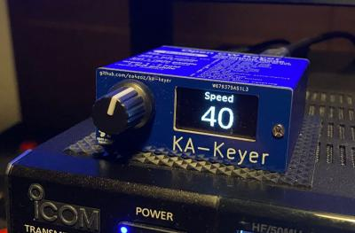
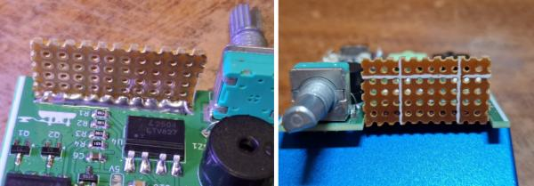
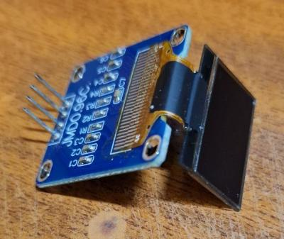
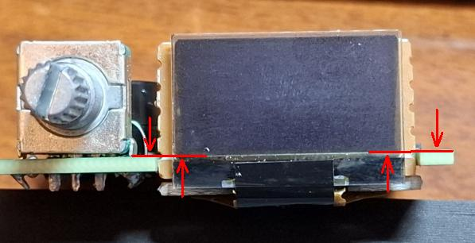
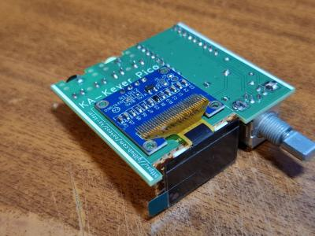
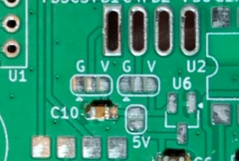
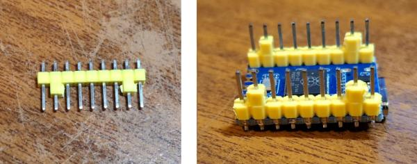
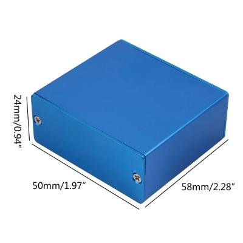
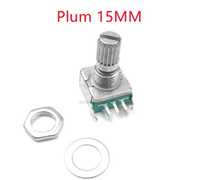

# KA-Keyer
## A simple keyer for the high speed CW operators

KA-Keyer is a simple keyer with an emphasis on high-speed operation. It can be considered a derivative from the Open CW Keyer MK2, an Arduino-based CW keyer from OK1CDJ.

This is the second keyer release, and the Arduino Nano board has been replaced by a Waveshare RP2040 Zero board (or compatible clone). Anyway the current firmware can be flashed on both keyers, the old ones based on Arduino Nano and the new ones based on the RP2040 chip with identical features.

## Features

- No bells and whistles. Just an almost dumb keyer you can use with or without a computer. If you need / want keying commands, memories, automatic serial numbers, and so on, this is not the keyer you want.

- Plain Iambic, Iambic A, Iambic B or Ultimate mode keying with corresponding dot/dash memories.

- Adjustable keying speed from 10 up to 99 WPM

- Adjustable dot weight between 25% and 75%

- Adjustable dit-dash ratio from 2.0 to 4.0

- Partial compatibility with WinKeyer, tested with N1MM, Fldigi, Rumlog...

- USB-C connector

## New in version 2.2

- EEPROM leveling, to prevent premature EEPROM wearing.

- On screen CW decoder, useful to practice yourself and check your manipulation.

- General code optimizations and rewrite in a more C-like way.

## Usage

The user interface is quite simple. A short press on the rotary button changes between menu entries and the rotary action changes the value of the selected menu. There are two sets of menus: The most often used and the less often used.

The first set of menus contains the most used options:

__Speed__: The CW speed, using the PARIS method, where the dot length is calculated, in milliseconds, as 1200 divided by the desired speed.

__Weight__: The dot weight, defined as the percentage of time the dot last inside its own timeslot. Normal CW uses a 50% dot weight.

__Ratio__: The length of a dash in PARIS units. Normal CW uses a dash three times longer than the dot.

The second set of menus contais some less used adjustments:

__Decoder__: Enables or disables screen decoder. It can be configured to show uppercase or lowercase letters.

__Sidetone__: Enables or disables the built-in buzzer

__Sidetone__ __frequency__: Adjust the sidetone's audio frecuency, from 400 to 1500 Hz.

__Keyer__: Determines the type of keyer. It implements plain Iambic, Iambic A, Iambic B and Ultimate.

__Paddles__: to configure normal (point on left) or reverse paddles (point on right).

You can change between the two menu sets with a long press on the rotary button.

KA-Keyer has some level of compatibility with WinKeyer, so you can use it with logging and contest programs, like Fldigi, N1MM, RumLog, etc. Don't expect a support for every Winkeyer feature, but just the bare minimum as this function seems to be phased out in favour of transceiver's CAT keying.

## Compiling and flashing for the Arduino Nano based KA-Keyer

The old Arduino Nano based KA_Keyer will be supportted as long as the Atmega328p can withstand the new features and fixes.

To upgrade it with this version, first remove the jumper marked PRG at the back panel and connect it to your computer.

The firmware uses no external libraries so it should be very easy to make it to compile. For a sucessful flashing, after loading the ka-keyer.ino file, you must set up the arduino IDE in this way:

Menu ---> Tools ---> Board ---> Arduino AVR Boards ---> Arduino Nano

Menu ---> Tools ---> Processor ---> ATmega328p (Old bootloader) (*)

Menu ---> Tools ---> Port ---> Select the serial port your KA-Keyer is attached to.

After this, using Menu ---> Sketch ---> Upload (or Ctrl-U) should flash your keyer with KA-Keyer firmware without problems. If flashing was sucessful you should hear the leter __K__ while the screen shows the actual firmware version.

(*) While most of the Arduinos Nano I had came with the old bootloader, lately a few of them came with the new one, so if you get errors trying to flash your unit, try Menu ---> Tools ---> Processor ---> ATmega328p

Remember to put in back the jumper at the rear of the keyer after flashing it to prevent accidental flashing and / or keyer resets because the computer's OS polling the serial ports.

Many programs can't use the keyer without the jumper because it resets itself everytime the program opens the serial port (the jumper prevent this). If this is happening, you will hear a __K__ everytime the program is trying to connect with the keyer because it is resetting itself.

## Compiling and flashing for the Waveshare RP2040 Zero based KA-Keyer

First, make sure you have configured support for the RP2040 microcontroller in Arduino IDE.

Go to Menu ---> Preferences, and make sure you have the following URL added in the Aditional boards manager URLs box:

https://github.com/earlephilhower/arduino-pico/releases/download/global/package_rp2040_index.json

If not, after adding it the Arduino IDE will download all the required files to support the RP2040 microntroller.

Once the support for the RP2040 is installed, use your favorite text editor and edit this file:

.arduino15/packages/rp2040/hardware/rp2040/[VERSION]/cores/rp2040/SerialUSB.cpp

.arduino15 is a hidden directory in your home directory in Linux / Mac systems. On windows systems SerialUSB.cpp is located at:

C:\Users\{username}\AppData\Local\Arduino15\packages/rp2040/hardware/rp2040/[VERSION]/cores/rp2040/SerialUSB.cpp

[VERSION] is the current Raspberry Pi Pico SDK version installed, as the time of writting this 4.5.3

Once you have open the SerialUSB.cpp file in your editor look for the CheckSerialReset() function and empty it, for example:

    static void CheckSerialReset() {
        if (!_rebooting && (_bps == 1200) && (!_dtr)) {
    //      if (__isFreeRTOS) {
    //          __freertos_idle_other_core();
    //      }
    //      _rebooting = true;
    //      // Disable NVIC IRQ, so that we don't get bothered anymore
    //      irq_set_enabled(USBCTRL_IRQ, false);
    //      // Reset the whole USB hardware block
    //      reset_block(RESETS_RESET_USBCTRL_BITS);
    //      unreset_block(RESETS_RESET_USBCTRL_BITS);
    //      // Delay a bit, so the PC can figure out that we have disconnected.
    //      busy_wait_ms(3);
    //      reset_usb_boot(0, 0);
    //      while (1); // WDT will fire here
        }
    }

This is needed because the Waveshare RP2040 Zero, and many other boards with native USB support uses opening the serial port at 1200 bauds to reset and launch the bootloader. Any program supporting Winkeyer will open the serial port at 1200 bauds, so the board will reset and enters in the flashing mode, preventing the usage as a CW keyer.

Once you have empty the CheckSerialReset() function, you can select the board as Waveshare RP2040 Zero and flash it. The first time you can use the serial port to flash it, but next uploads must be done using the BOOT button and UF2 method.

Once you have programmed your board, you can restore the CheckSerialReset() function.

KA-keyer has been developed and tested using Arduino IDE version 2.3.5 but any other version should work just fine.

## Mounting a RP2040 based KA-Keyer

Some tips for mount the RP2040 based keyer:

### Mounting the OLED screen

Mounting the OLED screen is the most dificult part. First, you will need a small piece of PCB board, about 28 x 14 mm with at least one side of copper. You must solder it vertically to the main PCB using the tinned area as ahown in the next photos.

Now take the oled and separate the display glass from the small PCB. I use a small piece of dental floss carefully passing it between the glass and the PCB. Once the glass is free clean the adhesive using isopropyl alcohol.

Now using a piece of double-sided adhesive foam, put the OLED glass into the piece of PCB board you soldered earlier. For a good aling, put the end of the display area aligned with the upper side of the main PCB.

Now you can solder the OLED PCB to the main PCB, but first take note of the pinout of the OLED.

SSD1306 based oled display come with two different pinouts: GND-VCC-SCL-SDA, or VCC-GND-SCL-SDA, and in 5 volt or 3.3 volt versions. You can use all of them with KA-Keyer. There are two solder jumpers next to the OLED pins. Just place a small solder blob in each jumper according to the signal for that pin. G for GND or V for Vcc.

Most OLED modules displays work at 5 volts. They are easily identificables because in the OLED PCB you can find a voltage regulator, usually a small SOT-23 one marked 662K. If your OLED has this regulator, just put a solder blob on the 5V jumper and do not populate U6.

If your OLED module do not have any voltage regulator it is a 3.3 volts one. In this case populate U6 with a XC6206P332MR (SMD marking: 662K) SOT-23 voltage regulator and do not put any solder blob on the 5V jumper.

### Mounting the Waveshare RP2040 Zero board

The Waveshare RP2040 Zero board is a double side board with components at both sides, and there are some components under the board in the KA-Keyer main PCB so you need to solder it in a elevated form. Just put a pair of plastic insulators from a pin header as shown in the next photo and solder it to the board.

## Materials

### Aluminum box

The box used is the same used by the Open CW Keyer MK2, that can be find on sites like eBay, Aliexpress, etc. It is one announced as Extruded DIY Enclosure Aluminum Box with dimensions of 1.97 x 2.28 x 0.94 inches or 50 x 58 x 24 millimeters

### Rotary encoder

It is announced as a generic horizontal rotary EC11 encoder in sites like eBay, Aliexpress, ect. The one used is the one with 15mm handle. Use plum or half handle as you like.

## Links

The Open CW Keyer MK2 project repository:
[https://github.com/ok1cdj/OpenCWKeyerMK2](https://github.com/ok1cdj/OpenCWKeyerMK2)

Rotary encoder in Aliexpress:
[https://aliexpress.com/item/1005006128388016.html](https://aliexpress.com/item/1005006128388016.html)

Aluminum box in Aliexpress:
[https://aliexpress.com/item/1005008145475053.html](https://aliexpress.com/item/1005008145475053.html)

## License

The source files of the KA-Keyer in this repository are made available under the GPLv3 license.
